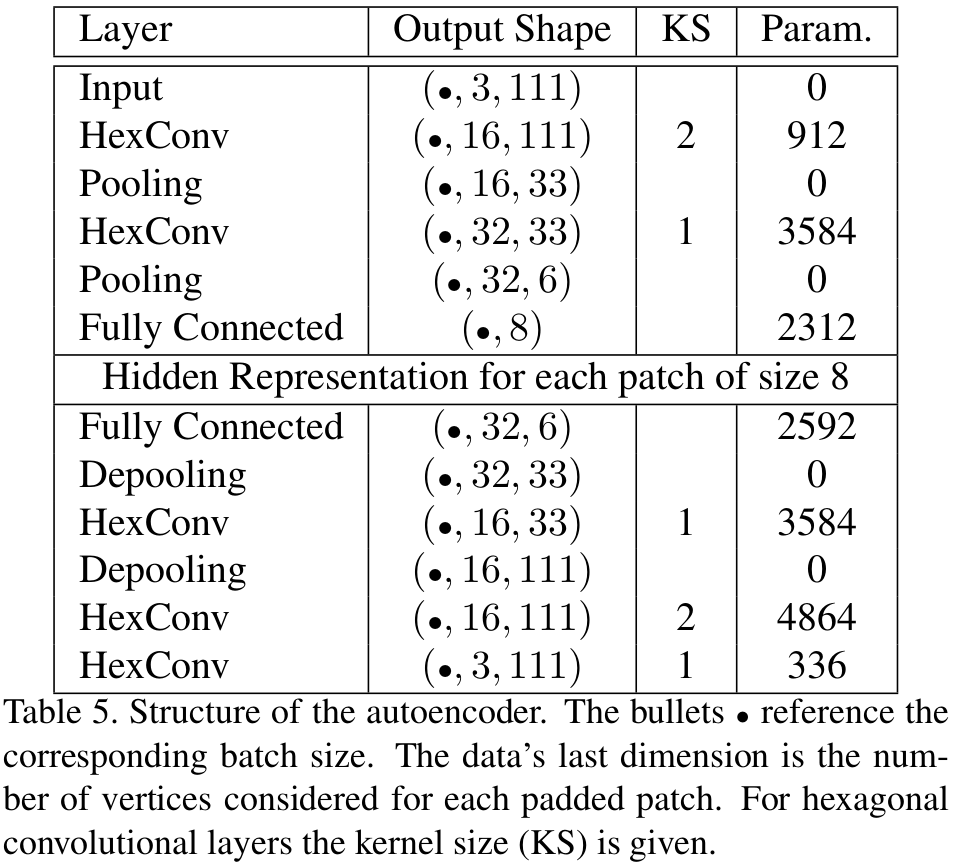

# Mesh Convolutional Autoencoder for Semi-Regular Meshes of Different Sizes

### Implementation of CoSMA: Convolutional Semi-Regular Mesh Autoencoder

[paper](https://openaccess.thecvf.com/content/WACV2022/html/Hahner_Mesh_Convolutional_Autoencoder_for_Semi-Regular_Meshes_of_Different_Sizes_WACV_2022_paper.html)

[arXiv publication](https://arxiv.org/abs/2110.09401v2)

**Sara Hahner and Jochen Garcke**  
*Fraunhofer Center for Machine Learning and SCAI, Sankt Augustin, Germany*   
*Institut für Numerische Simulation, Universität Bonn, Germany*

Contact sara.hahner@scai.fraunhofer.de for questions about code and data.

## 1. Abstract

The analysis of deforming 3D surface meshes is accelerated by autoencoders since the low-dimensional embeddings can be used to visualize underlying dynamics.
But, state-of-the-art mesh convolutional autoencoders require a fixed connectivity of all input meshes handled by the autoencoder. This is due to either the use of spectral convolutional layers or mesh dependent pooling operations. 
Therefore, the types of datasets that one can study are limited and the learned knowledge cannot be transferred to other datasets that exhibit similar behavior.
To address this, we transform the discretization of the surfaces to semi-regular meshes that have a locally regular connectivity and whose meshing is hierarchical. This allows us to apply the same spatial convolutional filters to the local neighborhoods and to define a pooling operator that can be applied to every semi-regular mesh. 
We apply the same mesh autoencoder to different datasets and our reconstruction error is more than 50\% lower than the error from state-of-the-art models, which have to be trained for every mesh separately.
Additionally, we visualize the underlying dynamics of unseen mesh sequences with an autoencoder trained on different classes of meshes.

## 2. Python Packages

- pytorch (1.7.1)
- pytorch3d (0.3.0)
- tqdm (4.56.0)
- [hexagdly](https://github.com/ai4iacts/hexagdly) [1] (no installation neccesary, scripts are already included in the directory [hexagly](hexagdly))
- igl python bindings (2.2.1) (conda install -c conda-forge igl)
- argparse 

## 3. Scripts and Code:
- [01_data_preprocessing](01_data_preprocessing.py): For the given dataset and experiment name (which has to correspond to the name of the semi-regular base mesh in directory data/*name of the dataset*/preprocessed/*name of the sample*) calculate the parametrization for the meshes of the same connectivity and project this parametrization over time.
- [02_create_input_patches](02_create_input_patches.py): For the given dataset, experiment name and test split create the patches and calculate the padding, which considers global context. The result is saved in data/*name of the dataset*/train_patches_*name of the experiment*
- [03_training](03_training.py): Train the autoencoder on all training samples of the given dataset. See Table 5 for the detailed network architecture.
- [04_testing](04_testing.py): Set the patches back together and calculate the errors as done for the paper.



- [networks](networks): Definition of the mesh convolutional autoencoder, which considers the padded regular patches of the semi-regular meshes
- [hexagdly](hexagdly): Hexagonal Convolution. Code from [HexagDLy - Processing Hexagonal Data with PyTorch](https://github.com/ai4iacts/hexagdly)
- [mesh](mesh): Mesh handling

## 4. Results

In the directory model you can find our trained models. Compare your results to the training errors in the txt-files in the directories model/*name of the dataset*/logs.
These files are written by the training and testing scripts. For each dataset we provide the data and code to reproduce the training and testing of the autoencoder for semi-regular meshes of different sizes.

## 5. Datasets and Reproduction of the Results

The data is automatically downloaded and extracted with the script [00_get_data.sh](scripts/00_get_data.sh).

File Structure in [data](data):
- name of the dataset ([gallop](data/gallop), [FAUST](data/FAUST), [car_TRUCK](data/car_TRUCK), [car_YARIS](data/car_YARIS))
  - **raw**: obj or ply files for each sample and version over time
    - versions: for the car datasets there is one directory for each simulations
    - samples: for every version there are the same samples. Every sample can have a different mesh (car-dataset: different components, gallop: different animals, FAUST: different persons)
    - version/samples: these directories contain the deformed meshes
    - the raw-directories also contain the template meshes for the different samples. The remeshing for each sample/class of meshes is based on this template mesh. We provide our remeshing results to semi-regular connectivity. 
  - **preprocessed**: for every sample we provide the semi-regular base mesh
  - **semiregular**: for every sample we provide the semi-regular mesh, which has been refined to level three and has been fit to the shape of the irregular template mesh
  - **train_patches**: train patches which are inputted to the network. This directory is created during the preprocessing.


### a) [GALLOP](data/gallop)

**Sumner et al: 2004: Deformation transferfor triangle meshes** [Webpage](https://people.csail.mit.edu/sumner/research/deftransfer/)

A dataset containing triangular meshes representing a motion sequence froma galloping horse, elephant, and camel.  Each sequence has 48 timesteps.  The three animals move in a similar way butthe meshes that represent the surfaces of the three animals are highly different in connectivity and in the number of vertices

```
bash 00_get_data.sh gallop
python 01_data_preprocessing.py --dataset gallop --exp_name coarsentofinalselection
python 02_create_input_patches.py --dataset gallop --exp_name coarsentofinalselection --test_split elephant
python 03_training.py --dataset gallop --exp_name coarsentofinalselection --model_name gallop_training.seed1 --hid_rep 8 --seed 1 
python 04_testing.py  --dataset gallop --exp_name coarsentofinalselection --model_name gallop_training.seed1 --hid_rep 8 --seed 1 --test_split elephant
```

### b) [FAUST](data/FAUST)

**Bogo et al, 2014: FAUST: Dataset and evaluation for 3Dmesh registration** [Webpage](http://faust.is.tue.mpg.de/)

We conduct two different experiments:  at first we consider known poses of two unseen bodies in the testing set.  Then we consider two unknown poses of all bodies in the testing set.  In both cases, 20% of the data is included in the testing set.

```
bash 00_get_data.sh FAUST
python 01_data_preprocessing.py --dataset FAUST --exp_name coarsento110
```

###### known poses: only interpolation of poses to different bodies
```
python 02_create_input_patches.py --dataset FAUST --exp_name coarsento110_inter --test_split faust8 faust9 --test_ratio 0
python 03_training.py --dataset FAUST --exp_name coarsento110_inter --model_name FAUST_knownpose.1 --hid_rep 8 --seed 1
python 04_testing.py  --dataset FAUST --exp_name coarsento110_inter --model_name FAUST_knownpose.1 --hid_rep 8 --seed 1 --test_split faust8 faust9 --test_ratio 0
```

###### unknown poses: only interpolation of poses to different bodies

```
python 02_create_input_patches.py --dataset FAUST --exp_name coarsento110 --test_split none --test_ratio 0.25
python 03_training.py --dataset FAUST --exp_name coarsento110 --model_name FAUST_unknownpose.1 --hid_rep 8 --seed 1 
python 04_testing.py  --dataset FAUST --exp_name coarsento110 --model_name FAUST_unknownpose.1 --hid_rep 8 --seed 1 --test_ratio 0.25
```

### c) [TRUCK](data/car_TRUCK) and [YARIS](data/car_YARIS)

**National Crash Analysis Center (NCAC). Finite Element Model Archive**

- TRUCK : 32  completed  frontal crash simulations of a Chevrolet C2500 pick-up truck, 6 components, 30 equally distributed time steps
- YARIS: 10 completed frontal crash simulations of a detailed model of the Toyota Yaris, 10 components, 26 equally distributed time steps

We provide the semi-regular template meshes for each component and its projection over time, because of the size of the raw data.

```
bash 00_get_data.sh car_TRUCK
bash 00_get_data.sh car_YARIS
python 02_create_input_patches.py --dataset car_YARIS --exp_name meshlab --test_ratio 1    --rotation_augment 0
python 02_create_input_patches.py --dataset car_TRUCK --exp_name meshlab --test_ratio -0.3 --rotation_augment 0 --test_version sim_041 sim_049
python 03_training.py --dataset car_TRUCK --exp_name meshlab_norot --model_name car_TRUCK_b50.2 --hid_rep 8 --seed 2 --Niter 250 --batch_size 50
python 04_testing.py  --dataset car_TRUCK --exp_name meshlab_norot --model_name car_TRUCK_b50.2 --hid_rep 8 --seed 2 --test_version sim_041 sim_049 --test_ratio -0.3
cp model/car_TRUCK/model_meshlab_norot_car_TRUCK_b50.2.pt model/car_YARIS/model_meshlab_norot_car_TRUCK_b50.2.pt
python 04_testing.py  --dataset car_YARIS --exp_name meshlab_norot --model_name car_TRUCK_b50.2 --hid_rep 8 --test_ratio 1
```

## 6. Remeshing

There are many ways to create the semi-regular meshes, that describe the irregular template meshes.

1. Create a coarse base mesh, for example using the implementation of the "Surface Simplification Using Quadric Error Metrics"-algorithm by Garland and Heckbert [2] in meshlab.
2. Iteratively subdivide the faces of the coarse base mesh into four faces.
3. Fit the newly created semi-regular mesh to the irregular template mesh.

For the second and third step you can use this jupyter notebook, provided by the authors of the Pytorch3D publication [3]: [deform_source_mesh_to_target_mesh](https://pytorch3d.org/tutorials/deform_source_mesh_to_target_mesh)

## Citation

```markdown
@InProceedings{Hahner2022,
    author    = {Hahner, Sara and Garcke, Jochen},
    title     = {Mesh Convolutional Autoencoder for Semi-Regular Meshes of Different Sizes},
    booktitle = {Proceedings of the IEEE/CVF Winter Conference on Applications of Computer Vision (WACV)},
    month     = {January},
    year      = {2022},
    pages     = {885-894}
}
```

## References

- [1] Steppa, Constantin, and Tim L. Holch. "HexagDLy—Processing hexagonally sampled data with CNNs in PyTorch." SoftwareX 9 (2019): 193-198.
- [2] Michael Garland and Paul S Heckbert. Surface simplification using quadric error metrics.  In Proceedings of the 24th Annual Conference on Computer Graphics and Interactive Techniques, pages 209–216, 1997.
- [3] Nikhila  Ravi,  Jeremy  Reizenstein,  David  Novotny,  Taylor Gordon, Wan-Yen Lo, Justin Johnson, and Georgia Gkioxari. Accelerating  3D  Deep  Learning  with  PyTorch3D. arXivpreprint arXiv:2007.08501, 2020.
